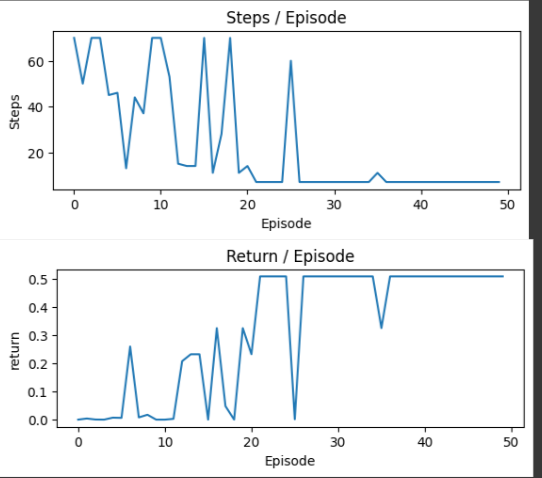
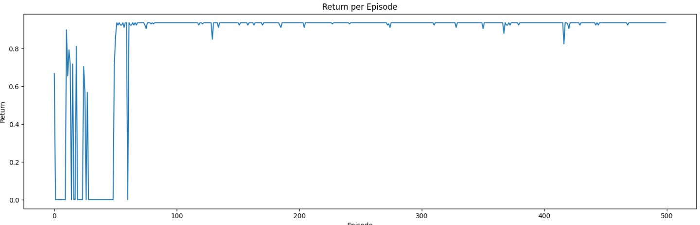
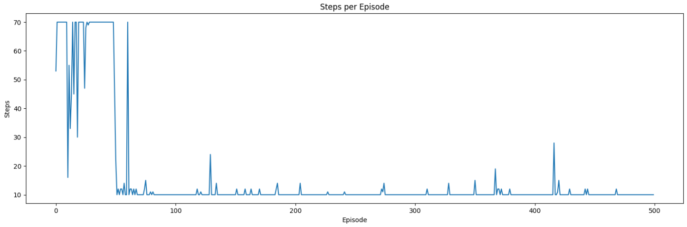
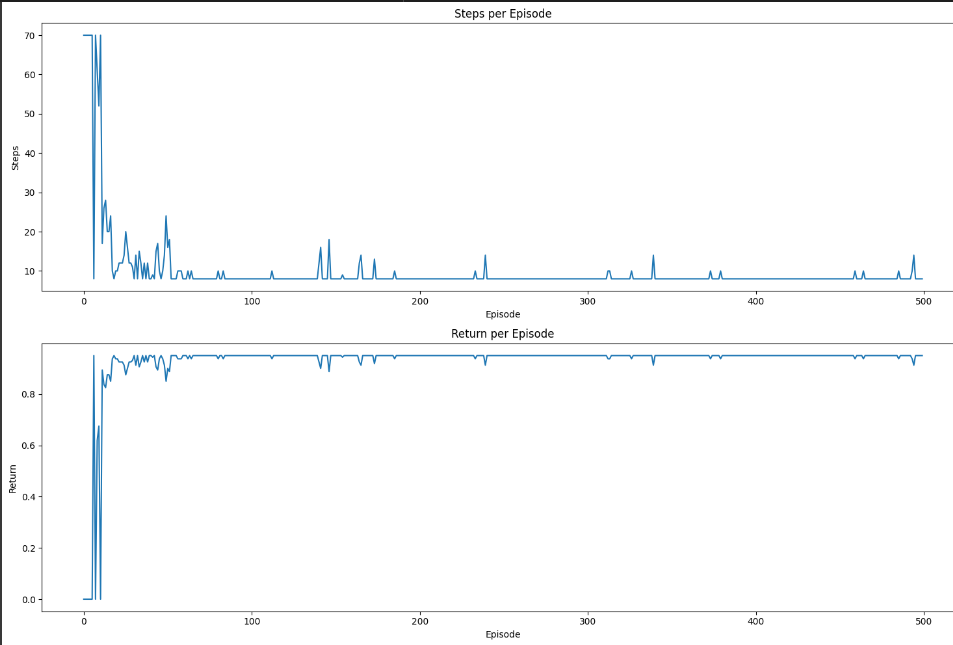
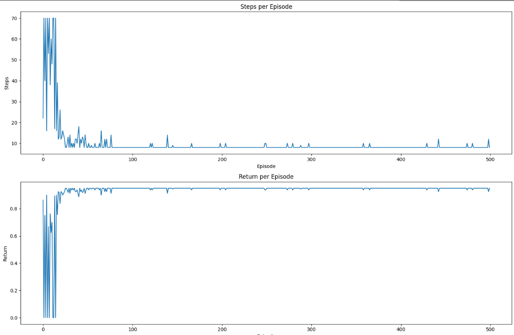

### Documentation:  
[Minigrid Empty Space Environment Documentation](https://minigrid.farama.org/environments/minigrid/EmptyEnv/)

### Minigrid Environment Overview

#### Observation Space:  

- **env.observation_space = { 'image': Box(0, 255, (7, 7, 3), uint8), 'direction': Discrete(4), 'mission': "Get to the green square" }**  

**Key Elements:**
- **Image:**  
  Represents the agent's view at any grid cell as a (7, 7, 3) matrix.  
  - The agent is visualized at the center of the 7x7 grid, can be termed as its "vision" (the set of grid cells it can perceive).  
  - The 3 channels in the matrix represent the RGB color intensities of each grid cell, ranging from 0 to 255.

- **Direction:**  
 Denotes the direction the agent is facing, with values in the range [0, 3]:
    
  | Value | Direction Faced |
  |-------|-----------|
  | 0     | Right     |
  | 1     | Down      |
  | 2     | Left      |
  | 3     | Up        |

- **Mission:**  
  A string that defines the agent's goal, typically "Get to the green square."

#### Action Space:  
Relevant actions for this environment:  

| Value | Action     |
|-------|----------- |
| 0     | Turn Left  |
| 1     | Turn Down  |
| 2     | Turn Right | 

When an action `a` is taken:  
`env.step(a)` returns a tuple:  
- `next_obs`: The observation space after taking action `a`.  
- `reward`: The immediate reward received after the action.  
- `done`: Boolean, `True` if the agent reaches the goal (termination condition).  
- `truncated`: Boolean, `True` if the episode terminates due to exceeding `max_steps`.  
- `info`: Additional information about the state.
#### Reward Function : 
- **Success:** A reward is calculated using the formula:  
  `Reward = 1 - 0.9 * (step_count / max_steps)`

- **Failure:** A reward of `0` is given.

---

## Minigrid Results:

### Monte Carlo

### SARSA

### SARSA_LAMBDA

### QLearning

